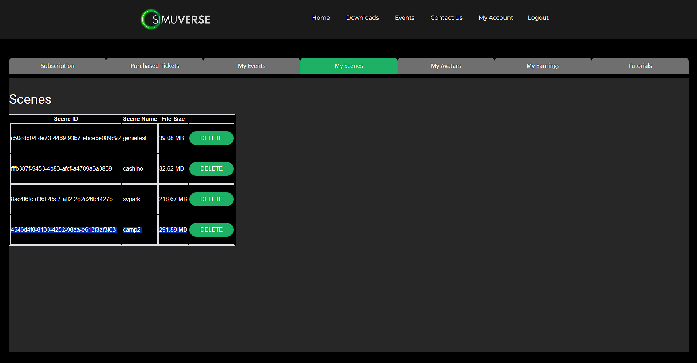

# Simuverse-Versekit

Simuverse-Versekit is a unitypackage that provides a set of tools/plugins to facilitate the creation and uploading of custom scenes to the Simuverse platform using Unity. This guide will walk you through the necessary steps to set up and use the tools.

## Installation

To use the Simuverse-Versekit, follow these steps:

1. Download the unity-package file to your local machine.
2. Create your new Unity project using Unity Editor version 2021.3.16f1 - Win64 platform mode only please for now
3. Install & Setup URP (Universal Render Pipeline) and OpenXR to ensure your graphics pipeline matches Simuverse'
4. Inside the project, navigate to and import the Simuverse unity-package file you downloaded.
5. Create an empty folder named `Assets/AssetBundles` if it doesn't already exist

## Usage

Once you have installed the package the plugin should be ready for use in your Unity project, follow these steps to upload your scene to the Simuverse platform:

Find 'Simuverse' in the Unity menu bar, and navigate to SceneUploader-> and follow the steps below as needed

1. **Step 1: Auto Mark Assets for Bundling**
   - Optional, In the Unity Editor menu, go to `Simuverse > Step 1. Auto Mark Assets for Bundling`.
   - This step will mark ALL scene assets in the project to be added to the asset bundle, super handy to use if you bring in all of your assets before editor scripts/plugins/other things you dont want to include

2. **Step 2: Mark Assets Read+Write***
	- Optional, use this to mark ALL textures, mesh etc and any other assets that have a readable/writable property on them in the project to true all at once -- handy if you import a whole bunch of mesh/textures/etc because this will need to be checked on all of them for them to make it into the asset bundle properly.

3. **Step 3: Generate AssetBundles**
   - In the Unity Editor menu, go to `Simuverse > Step 2. Generate AssetBundles`.
   - This step will generate the raw asset bundles.

4. **Step 4: Convert AssetBundles to VerseCache**
   - In the Unity Editor menu, go to `Simuverse > Step 3. Convert AssetBundles to VerseCache`.
   - This step will convert the generated raw asset bundles to a single VerseCache formatted file.

5. **Step 5: Upload to Simuverse Server**
   - In the Unity Editor menu, go to `Simuverse > Step 4. Upload to Simuverse Server`.
   - A settings window will appear.
   - Enter your Simuverse email and password in the respective fields if not already there.
   - Provide a scene name (it doesn't have to match the actual scene name), one easy to remember word and no special characters please
   - Click the "Submit" button to start the upload process.
   - The tool will upload the scene to the Simuverse scene server.
   - Once the upload is complete, a confirmation dialog will appear.
   - If there is a problem with the upload, it will let you know.
   

 
   

   

**Notes:** To use the scene uploader properly, make sure your Unity project contains only one scene -- feel free to use the project search bar and select the Scenes filter to show all scenes in the project. It's recommended to remove any unused assets from the project to minimize the asset bundle's file size.

## Additional Features

You may find some useful items in _Prefabs folder -- for Sitpoints, Custom Spawnpoint, Mediascreen -- simply drop them into your scene, children of objects, etc  We will explain how to use these and some other goodies in there in more detail soon via a video workshop.

## Contact and Support

After uploading your scene, you can select the 'CustomScene' on our web-app via your Simuverse account during event setup/edit.

That's it! You're now ready to create and upload scenes to the Simuverse platform. Happy scene creation!

---

For any questions, support, or feedback regarding the Simuverse-Versekit unity plugin, please join our discord server.